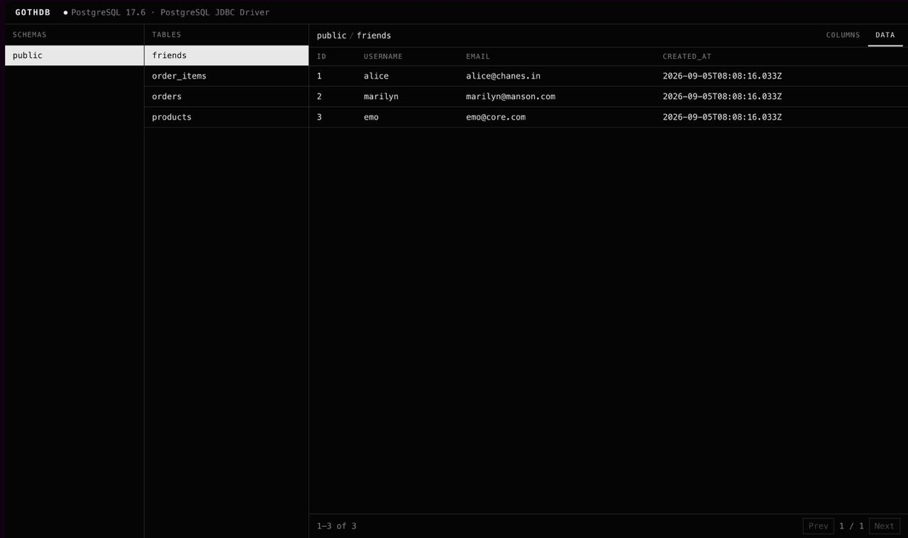
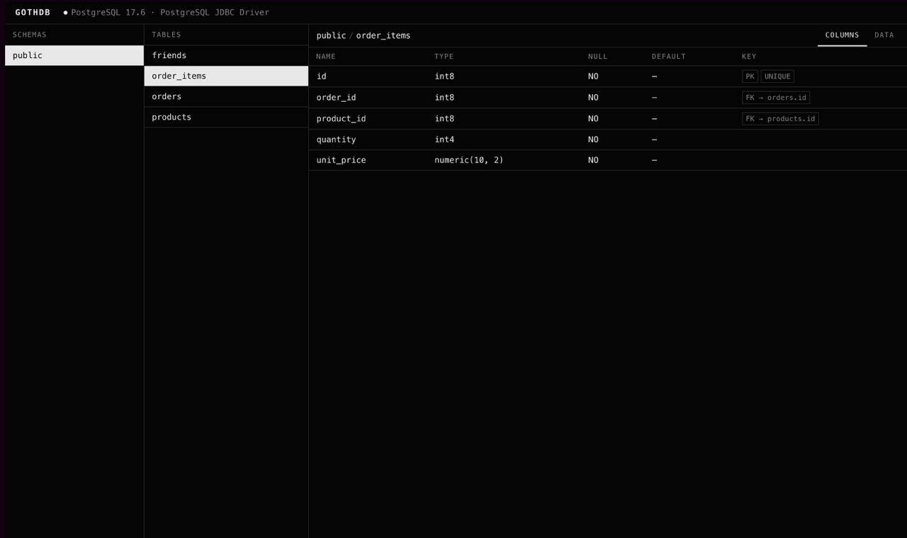

# gothdb

Modern read-only database explorer for PostgreSQL, shipped as a Spring Boot auto-configuration starter.

> **Early release — not production-ready.** PostgreSQL is the currently supported database. Expect breaking changes.

## Preview

Browse PostgreSQL table data with stable primary-key pagination:



Inspect columns, native types, nullability, primary keys, unique constraints, and foreign keys:



## What works right now

- Drop `gothdb-spring-boot-starter` into a Spring Boot app with a `DataSource` — it auto-configures itself, no manual wiring.
- Read-only REST API over `DatabaseMetaData`:
  - `GET /gothdb/api/status`
  - `GET /gothdb/api/schemas`
  - `GET /gothdb/api/schemas/{schema}/tables`
  - `GET /gothdb/api/schemas/{schema}/tables/{table}/columns`
  - `GET /gothdb/api/schemas/{schema}/tables/{table}/primary-key`
  - `GET /gothdb/api/schemas/{schema}/tables/{table}/foreign-keys`
  - `GET /gothdb/api/schemas/{schema}/tables/{table}/indexes`
  - `GET /gothdb/api/schemas/{schema}/tables/{table}/rows?page=&size=`
- Unified error handling (400 bad params, 404 unknown schema/table, generic 500 — no JDBC internals leaked).
- A minimalist black-and-white UI (`ui/`): schemas → tables → columns/data, with connection status.

## Quick start (PostgreSQL consumer app)

Requirements:

- Java 21+
- Maven 3.9+
- Docker

Build the project:

```bash
mvn package
```

Start PostgreSQL on its standard port `5432`:

```bash
docker run --name gothdb-postgres \
  -e POSTGRES_DB=gothdb \
  -e POSTGRES_USER=gothdb \
  -e POSTGRES_PASSWORD=gothdb \
  -p 5432:5432 \
  -d postgres:17.6-alpine
```

If host port `5432` is already in use, choose another one (for example `-p 5433:5432`) and use the
same port in `DATABASE_URL`.

Wait until PostgreSQL is ready:

```bash
docker logs -f gothdb-postgres
```

Run the external-style consumer application against that container:

```bash
DATABASE_URL=jdbc:postgresql://localhost:5432/gothdb \
DATABASE_USERNAME=gothdb \
DATABASE_PASSWORD=gothdb \
java -jar integration-tests/consumer-app/target/gothdb-consumer-app-0.0.1-SNAPSHOT.jar
```

On the first run, Spring initializes the same sample catalog previously used by the demo: friends,
products, orders, and order items. Open the UI at `http://localhost:8080/gothdb/`.

The database remains initialized while the container exists. For subsequent application starts, skip
the SQL initializer to avoid recreating the same tables:

```bash
DATABASE_URL=jdbc:postgresql://localhost:5432/gothdb \
DATABASE_USERNAME=gothdb \
DATABASE_PASSWORD=gothdb \
java -jar integration-tests/consumer-app/target/gothdb-consumer-app-0.0.1-SNAPSHOT.jar \
  --spring.sql.init.mode=never
```

To verify a custom GothDB path without editing `application.yml`:

```bash
DATABASE_URL=jdbc:postgresql://localhost:5432/gothdb \
DATABASE_USERNAME=gothdb \
DATABASE_PASSWORD=gothdb \
java -jar integration-tests/consumer-app/target/gothdb-consumer-app-0.0.1-SNAPSHOT.jar \
  --spring.sql.init.mode=never \
  --gothdb.path=/ur-path
```

The UI and API then move together:

- UI: `http://localhost:8080/ur-path/`
- API status: `http://localhost:8080/ur-path/api/status`
- the old `/gothdb/` path returns `404`

Stop the container while keeping its database:

```bash
docker stop gothdb-postgres
```

Start it again later:

```bash
docker start gothdb-postgres
```

Or permanently remove the test container and its data:

```bash
docker rm -f gothdb-postgres
```

The Maven build installs a project-local Node.js, runs `npm ci`, bundles the UI into the
`gothdb-autoconfigure` JAR under `META-INF/gothdb`, and serves it from `gothdb.path`. A separate Node.js
process is not needed for normal use.

## Using the starter

Add the starter and PostgreSQL driver to a Spring Boot application that already configures a JDBC
`DataSource`:

```xml
<dependency>
    <groupId>io.github.lessmade</groupId>
    <artifactId>gothdb-spring-boot-starter</artifactId>
    <version>0.0.1-SNAPSHOT</version>
</dependency>

<dependency>
    <groupId>org.postgresql</groupId>
    <artifactId>postgresql</artifactId>
    <scope>runtime</scope>
</dependency>
```

No GothDB beans need to be declared manually. With a servlet application and a `DataSource`, the API
and embedded UI are auto-configured.

## Frontend development

For frontend development, run the Vite dev server; it proxies API calls to the backend:

```bash
cd ui
npm install
npm run dev
```

Open `http://localhost:5173`.

## Tests

Run the unit and auto-configuration tests without external services:

```bash
mvn test
```

Run all PostgreSQL integration tests (Docker is required):

```bash
mvn verify -Ppostgresql-integration-tests
```

Testcontainers starts isolated PostgreSQL 17.6 containers on random ports, runs both the core metadata
integration test and the consumer application end-to-end HTTP test, and removes the containers after
the build. A manually started `gothdb-postgres` container is not required for this command.

## Configuration

```yaml
gothdb:
  enabled: true   # default true, auto-disables without a servlet DataSource
  path: /gothdb    # base path for the API and UI
  ui:
    enabled: true  # set false to expose only the REST API
  schemas:
    include: []    # empty means all schemas
    exclude:       # PostgreSQL system schemas are excluded by default
      - information_schema
      - pg_catalog
      - pg_toast
      - pg_temp_*
      - pg_toast_temp_*
  rows:
    count-mode: exact # exact returns totals; none avoids COUNT(*)
    max-page-size: 200
    query-timeout: 5s
```

## Modules

- `core` — framework-agnostic JDBC metadata reading, no Spring dependency.
- `autoconfigure` — Spring Boot auto-configuration, REST controllers, error handling.
- `spring-boot-starter` — the dependency consumers actually add to their project.
- `integration-tests/consumer-app` — runnable PostgreSQL consumer and end-to-end Testcontainers test; it depends on GothDB through the starter.
- `ui` — the Vite + React frontend, built by Maven and packaged into `gothdb-autoconfigure`.
